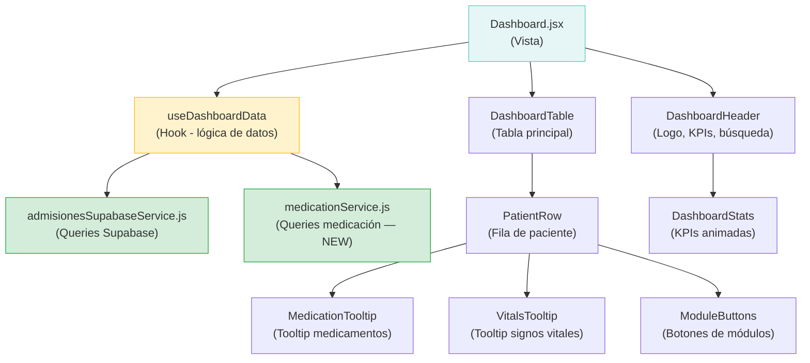

# Análisis e Integración del Módulo Dashboard — Clínica Atlas

## 🔹 1. Diagnóstico

### Archivos analizados
| Archivo | Líneas | Rol |
|---|---|---|
| [Dashboard.jsx](file:///e:/Diego/A%20IMAGENES%20CLINICA%20ATLAS/PROYECTO-CLINICA-ATLAS/App-Web-Clinica-Atlas/src/pages/Dashboard.jsx) | **1649** | Página principal — Rack Hospitalario |
| [PatientCard.jsx](file:///e:/Diego/A%20IMAGENES%20CLINICA%20ATLAS/PROYECTO-CLINICA-ATLAS/App-Web-Clinica-Atlas/src/modules/dashboard/components/PatientCard.jsx) | 123 | Componente card (no usado) |
| [PatientSearchBar.jsx](file:///e:/Diego/A%20IMAGENES%20CLINICA%20ATLAS/PROYECTO-CLINICA-ATLAS/App-Web-Clinica-Atlas/src/modules/dashboard/components/PatientSearchBar.jsx) | 40 | Barra de búsqueda (no usada) |
| [PatientsGrid.jsx](file:///e:/Diego/A%20IMAGENES%20CLINICA%20ATLAS/PROYECTO-CLINICA-ATLAS/App-Web-Clinica-Atlas/src/modules/dashboard/components/PatientsGrid.jsx) | 54 | Grid de pacientes (no usada) |
| [DashboardStats.jsx](file:///e:/Diego/A%20IMAGENES%20CLINICA%20ATLAS/PROYECTO-CLINICA-ATLAS/App-Web-Clinica-Atlas/src/modules/dashboard/components/DashboardStats.jsx) | 78 | KPIs (no usada) |
| [useDashboardData.js](file:///e:/Diego/A%20IMAGENES%20CLINICA%20ATLAS/PROYECTO-CLINICA-ATLAS/App-Web-Clinica-Atlas/src/modules/dashboard/hooks/useDashboardData.js) | 132 | Hook de datos (no usado, apunta a Firebase) |
| [colors.js](file:///e:/Diego/A%20IMAGENES%20CLINICA%20ATLAS/PROYECTO-CLINICA-ATLAS/App-Web-Clinica-Atlas/src/shared/theme/colors.js) | 502 | Sistema de colores centralizado |
| [accessControl.js](file:///e:/Diego/A%20IMAGENES%20CLINICA%20ATLAS/PROYECTO-CLINICA-ATLAS/App-Web-Clinica-Atlas/src/constants/accessControl.js) | 27 | Control de acceso por roles |

---

### 🔴 A. Componentes importados pero NUNCA usados en Dashboard.jsx

| Import (línea) | ¿Se usa en JSX? | Problema |
|---|---|---|
| `GraficoPastelServicio` (L3) | ❌ No | Importado, nunca renderizado |
| `PatientCard, PatientSearchBar, PatientsGrid` (L15) | ❌ No | Se importan del módulo `dashboard/components` pero el Dashboard usa su propia tabla inline |
| `getStatusColor` (L16) | ❌ No | Se importa del theme centralizado pero Dashboard define su propio `estadosPaciente` (L195-202) y `servicioColor` (L714-725) inline |
| `Input` (L5) | ✅ Sí (L1195) | OK — se usa |
| `Badge` (L10) | ❌ No | Importado, nunca renderizado en el JSX |

### 🔴 B. Funciones/variables definidas pero NUNCA usadas

| Función/Variable | Línea | Problema |
|---|---|---|
| `servicioColor()` | L714-725 | Definida, nunca llamada en ninguna parte del JSX |
| `resumenVitales` (const estática) | L729-736 | Usada como fallback en `getDynamicResumenVitales` pero la función siempre puede fallar silenciosamente — el fallback es correcto pero la const misma es sombra de la dinámica |
| `names = ['PARTE OPERATORIO']` | L275 | Definida, nunca usada |
| `moduleColors` | L277-283 | Se usa en L1586 ✅, pero 'Parte Operatorio' nunca coincide con un módulo renderizado (los módulos son 'Modulo Médico', 'Modulo Enfermeria', etc.) — key muerta |

### 🔴 C. Hook `useDashboardData` creado pero NUNCA conectado

```
src/modules/dashboard/hooks/useDashboardData.js
```

Este hook fue diseñado para extraer la lógica del Dashboard, pero:
1. Usa **Firebase** (`import { db } from '@/firebaseConfig'`), mientras que Dashboard.jsx ahora usa **Supabase**
2. **Nadie lo importa**: no existe ningún `import { useDashboardData }` en ningún archivo del proyecto
3. También importa `useAsync` de `@/shared/hooks`, que existe pero nunca se usa dentro del hook
4. El modelo de datos es diferente: usa campos como `primerNombre`, `apellidoPaterno` vs el Dashboard que usa `firstName`, `lastName`

> [!CAUTION]
> El hook `useDashboardData` y los componentes `PatientCard`, `PatientsGrid`, `DashboardStats` fueron creados como parte de una refactorización planificada pero **nunca se conectaron**. Son código muerto que apunta a Firebase mientras el sistema real ya migró a Supabase.

### 🔴 D. Duplicación de lógica de colores de estado

El Dashboard define **dos sistemas de colores de estado paralelos**:

1. **Interno** — `estadosPaciente` (L195-202): `{ color: 'bg-gray-400', text: 'text-gray-700' }`
2. **Centralizado** — `getStatusColor()` de `@/shared/theme/colors.js`: `'bg-gray-100 text-gray-700'`

Ambos mapean los mismos estados pero con valores diferentes. El centralizado es más completo (incluye 'emergencia', 'serv rx', etc.) pero **no se usa**.

### 🔴 E. Paginación estática (falsa)

```jsx
// L1626-1643 — Pie de página con botones 1, 2, 3, 4
<span className="px-3 py-1 ...">1</span>
<span className="px-3 py-1 ...">2</span>
```

Los botones de paginación son elementos estáticos sin lógica. No hay `useState` de página, no hay `slice()` de datos. Son **puramente decorativos**.

### 🔴 F. Queries directas a Supabase dentro del componente

Toda la lógica de medicación (L348-485) hace queries directas a Supabase con `supabase.from('clinical_evolution').select(...)` **dentro del Dashboard**, duplicando la responsabilidad del service layer. Esto NO pasa por `admisionesSupabaseService.js`.

### 🟡 G. Modelo de datos inconsistente entre módulos refactorizados y Dashboard

| Campo en Dashboard (`mapAdmisionToMain`) | Campo en `PatientCard` | Coinciden? |
|---|---|---|
| `main.nombre` (firstName + lastName) | `patient.primerNombre` + `patient.apellidoPaterno` | ❌ |
| `main.cedula` | `patient.cedula` | ✅ |
| `main.estado` | `state` (prop) | ✅ (diferente mecanismo) |
| `main.servicio` | `patient.servicio` | ✅ |
| `main.fechaIngreso` | `patient.fechaAdmision` | ❌ |
| Signos vitales via `getDynamicResumenVitales()` | `patient.vitales` | ❌ |

---

## 🔹 2. Flujo esperado



**Flujo correcto:**
1. `Dashboard.jsx` ← solo renderiza UI
2. `useDashboardData()` ← toda la lógica de estado, queries, subscripciones
3. Componentes sub-extraídos ← tooltips, stats, fila de paciente
4. Services ← únicas capas que hablan con Supabase

---

## 🔹 3. Solución propuesta — Plan incremental por fases

> [!IMPORTANT]
> Cada fase es auto-contenida. Puedes aprobar y ejecutar una por una sin romper lo existente.

### Fase 1: Limpieza de código muerto *(bajo riesgo)*
**Objetivo:** Eliminar imports muertos y variables no usadas para reducir ruido.

#### [MODIFY] [Dashboard.jsx](file:///e:/Diego/A%20IMAGENES%20CLINICA%20ATLAS/PROYECTO-CLINICA-ATLAS/App-Web-Clinica-Atlas/src/pages/Dashboard.jsx)
- ❌ Eliminar import de `GraficoPastelServicio` (L3)
- ❌ Eliminar import de `PatientCard, PatientSearchBar, PatientsGrid` (L15)
- ❌ Eliminar import de `getStatusColor` (L16)
- ❌ Eliminar import de `Badge` (L10)
- ❌ Eliminar `const names = ['PARTE OPERATORIO']` (L275)
- ❌ Eliminar función `servicioColor()` (L714-725)

---

### Fase 2: Unificar sistema de colores de estado *(bajo riesgo)*
**Objetivo:** Usar el system centralizado `getStatusColorObject()` de `@/shared/theme/colors.js` en vez del `estadosPaciente` hardcodeado.

#### [MODIFY] [Dashboard.jsx](file:///e:/Diego/A%20IMAGENES%20CLINICA%20ATLAS/PROYECTO-CLINICA-ATLAS/App-Web-Clinica-Atlas/src/pages/Dashboard.jsx)
- Reemplazar `estadosPaciente` (L195-202) por uso de `getStatusColorObject()` de `colors.js`
- Actualizar uso en L1513 y L1525 para usar el centralizado
- Agregar import: `import { getStatusColorObject } from '@/shared/theme/colors'`

---

### Fase 3: Extraer lógica de medicación a un service *(riesgo medio)*
**Objetivo:** Las queries de medicación (L359-485) van directo a Supabase desde el componente. Extraerlas a un servicio dedicado.

#### [NEW] `src/services/medicationService.js`
- Mover `loadMedicationData()` como función de servicio
- Mover `buildMedicationRecordsByKey()` y helpers relacionados
- Mover la lógica de `handleMedicationHourClick()` (insert en `medicamentos_administraciones`)

#### [MODIFY] [Dashboard.jsx](file:///e:/Diego/A%20IMAGENES%20CLINICA%20ATLAS/PROYECTO-CLINICA-ATLAS/App-Web-Clinica-Atlas/src/pages/Dashboard.jsx)
- Reemplazar queries directas por llamadas al servicio
- Eliminar import directo de `supabase`

---

### Fase 4: Extraer sub-componentes del JSX *(riesgo medio)*
**Objetivo:** Dashboard.jsx tiene 1649 líneas con todo inline. Extraer secciones lógicas como componentes.

#### [NEW] `src/modules/dashboard/components/DashboardHeader.jsx`
- Header con logo, KPIs, botones de acción, búsqueda (L981-1204)

#### [NEW] `src/modules/dashboard/components/PatientTableRow.jsx`
- Fila individual de la tabla con toda la lógica de un paciente (L1251-1616)

#### [NEW] `src/modules/dashboard/components/MedicationTooltip.jsx`
- Tooltip de horarios de medicamentos (L1406-1501)

#### [NEW] `src/modules/dashboard/components/VitalsTooltip.jsx`
- Tooltip de signos vitales (L1282-1312)

#### [MODIFY] [Dashboard.jsx](file:///e:/Diego/A%20IMAGENES%20CLINICA%20ATLAS/PROYECTO-CLINICA-ATLAS/App-Web-Clinica-Atlas/src/pages/Dashboard.jsx)
- Usar los nuevos componentes en el render

---

### Fase 5: Actualizar `useDashboardData` para Supabase *(riesgo medio-alto)*
**Objetivo:** El hook existe pero apunta a Firebase. Reescribirlo para Supabase y conectarlo al Dashboard.

#### [MODIFY] [useDashboardData.js](file:///e:/Diego/A%20IMAGENES%20CLINICA%20ATLAS/PROYECTO-CLINICA-ATLAS/App-Web-Clinica-Atlas/src/modules/dashboard/hooks/useDashboardData.js)
- Migrar de Firebase a Supabase
- Alinear nombres de campos con el modelo actual del Dashboard
- Incorporar medicación y signos vitales
- Eliminar import de Firebase y `useAsync`

#### [MODIFY] [Dashboard.jsx](file:///e:/Diego/A%20IMAGENES%20CLINICA%20ATLAS/PROYECTO-CLINICA-ATLAS/App-Web-Clinica-Atlas/src/pages/Dashboard.jsx)
- Reemplazar los ~8 `useState` + ~4 `useEffect` por `useDashboardData()`

---

### Fase 6: Implementar paginación real *(bajo riesgo)*
**Objetivo:** Los botones de paginación son decorativos. Conectarlos o eliminarlos.

#### [MODIFY] [Dashboard.jsx](file:///e:/Diego/A%20IMAGENES%20CLINICA%20ATLAS/PROYECTO-CLINICA-ATLAS/App-Web-Clinica-Atlas/src/pages/Dashboard.jsx)
- Agregar `const [page, setPage] = useState(1)` y `ITEMS_PER_PAGE`
- Paginar `sortedMains` con `slice()`
- Conectar botones del footer

---

## 🔹 4. Código sugerido — Fase 1 (limpieza inmediata)

### Imports a eliminar:

```diff
-import GraficoPastelServicio from '../components/GraficoPastelServicio';
-import { PatientCard, PatientSearchBar, PatientsGrid } from '@/modules/dashboard/components';
-import { getStatusColor } from '@/shared/theme/colors';
-import { Badge } from '@/components/ui/badge';
```

### Variables muertas a eliminar:

```diff
-  const names = ['PARTE OPERATORIO'];
```

```diff
-  const servicioColor = (servicio) => {
-    switch (servicio) {
-      case 'UCI':
-        return 'bg-red-100 text-red-700';
-      case 'EMERGENCIA':
-        return 'bg-orange-100 text-orange-700';
-      case 'HOSPITALIZACION':
-        return 'bg-blue-100 text-blue-700';
-      default:
-        return 'bg-gray-100 text-gray-700';
-    }
-  };
```

### Código sugerido — Fase 2 (unificar colores):

```diff
+import { getStatusColorObject } from '@/shared/theme/colors';

-  const estadosPaciente = {
-    'Espera': { color: 'bg-gray-400', text: 'text-gray-700' },
-    'Atención': { color: 'bg-blue-500', text: 'text-blue-700' },
-    'Terapia Intensiva': { color: 'bg-red-500', text: 'text-red-700' },
-    'Alta Médica': { color: 'bg-green-500', text: 'text-green-700' },
-    'Procedimiento': { color: 'bg-yellow-500', text: 'text-yellow-700' },
-    'Quirófano': { color: 'bg-orange-500', text: 'text-orange-700' },
-  };
```

En el JSX del selector de estados (L1512-1535), cambiar:

```diff
  {/* Punto de color */}
  <span
-   className={`w-3 h-3 rounded-full ${(estadosPaciente[estadoActualFila] || estadosPaciente['Atención']).color}`}
+   className="w-3 h-3 rounded-full"
+   style={{ backgroundColor: getStatusColorObject(estadoActualFila).badge }}
  />
```

Y en las opciones del selector, generar dinámicamente:

```diff
-  {Object.keys(estadosPaciente).map((opcion) => (
+  {['Espera', 'Atención', 'Terapia Intensiva', 'Alta Médica', 'Procedimiento', 'Quirófano'].map((opcion) => (
     <option key={opcion} value={opcion}>
       {opcion}
     </option>
   ))}
```

### Código sugerido — Fase 3 (service de medicación):

```javascript
// src/services/medicationService.js
import { supabase } from '@/lib/supabaseClient.js';

const MEDICATION_ADMIN_TABLE =
  import.meta.env.VITE_SUPABASE_MEDICATION_ADMIN_TABLE || 'medicamentos_administraciones';

export async function getMedicationPlanByAdmisionId(admisionId) {
  const { data: evolutions, error } = await supabase
    .from('clinical_evolution')
    .select(`
      id, created_at,
      medicamentos (
        id, clinical_evolution_id, medicamento, via, frecuencia,
        hora_inicio, intervalo_horas, proxima_toma,
        presentacion, administra, cantidad, indicacion, created_at
      )
    `)
    .eq('admision_id', admisionId)
    .order('created_at', { ascending: false });

  if (error) throw error;

  const medications = [];
  (evolutions || []).forEach((evolution) => {
    (evolution?.medicamentos || []).forEach((med) => {
      medications.push({
        ...med,
        source: 'Registro medicación',
        clinical_evolution_id: med?.clinical_evolution_id || evolution?.id || null,
      });
    });
  });
  return medications;
}

export async function getMedicationAdminRecords(admisionId) {
  const { data, error } = await supabase
    .from(MEDICATION_ADMIN_TABLE)
    .select('*')
    .eq('admision_id', admisionId)
    .order('timestamp', { ascending: false });

  if (error && error.code !== '42P01') throw error;
  return data || [];
}

export async function registerMedicationAdministration(payload) {
  const { error } = await supabase.from(MEDICATION_ADMIN_TABLE).insert([payload]);
  if (error) throw error;
}
```

---

## 🔹 5. Riesgos

| Riesgo | Fase | Severidad | Mitigación |
|---|---|---|---|
| Eliminar import rompe componente que SÍ se usa en otro lugar | Fase 1 | 🟢 Bajo | Verificado con grep: `GraficoPastelServicio`, `PatientCard`, etc. NO tienen uso fuera de Dashboard.jsx |
| Cambio de sistema de colores altera apariencia visual | Fase 2 | 🟡 Medio | Los colores del centralizado son ligeramente diferentes (ej: `bg-gray-100` vs `bg-gray-400`). Revisar visualmente |
| Extraer queries de medicación rompe realtime | Fase 3 | 🟡 Medio | Mantener el patrón de subscripción Supabase exacto. Los channels deben quedarse en el hook/componente |
| Extraer componentes pierde acceso a closures del Dashboard | Fase 4 | 🟡 Medio | Pasar funciones como props; no depender de closures implícitas |
| Migrar `useDashboardData` de Firebase a Supabase | Fase 5 | 🔴 Alto | Puede afectar datos si el mapping de campos es incorrecto. Hacer prueba paralela: mantener lógica actual como fallback |
| `useDashboardData` importa `useAsync` de `@/shared/hooks` que puede no existir | Fase 5 | 🟡 Medio | Verificado: `@/shared/hooks/index.js` existe. Eliminarlo del import al reescribir |

---

## Open Questions

> [!IMPORTANT]
> **¿Qué fases quieres que ejecute primero?** Recomiendo empezar por **Fase 1 + Fase 2** que son cambios de limpieza sin riesgo funcional y reducen ruido de ~80 líneas. ¿Procedo con esas, o prefieres ir directo a la extracción de componentes (Fase 4)?

> [!WARNING]
> **La paginación (Fase 6)**: ¿cuántos pacientes manejan normalmente? Si son <60, quizás no vale la pena paginar y sería mejor eliminar los botones falsos del footer. Si son >100, sí necesitamos paginación real o virtual scrolling.

## Verification Plan

### Automated Tests
- `npm run build` — verificar que no hay imports rotos después de cada fase
- `npm run dev` — verificar que la app carga sin errores de consola

### Manual Verification
- Después de Fase 2: comparar visualmente los colores de estados en el Dashboard
- Después de Fase 3: verificar que los checks de medicación siguen funcionando (registro + realtime)
- Después de Fase 5: verificar carga de datos, filtro por búsqueda, y subscripciones en tiempo real
